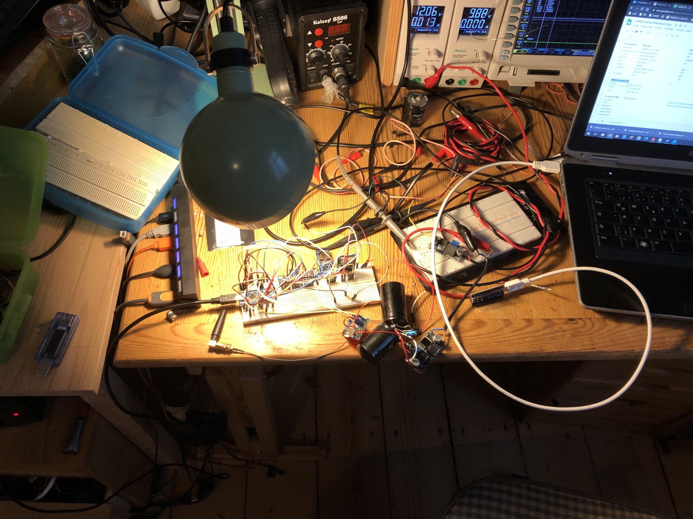
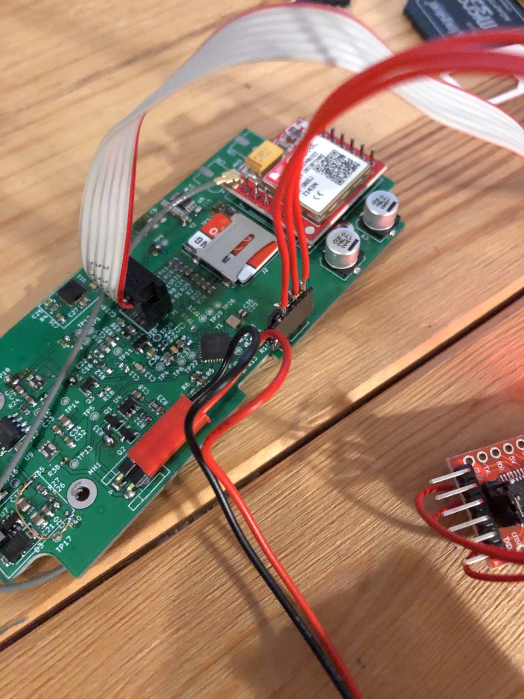
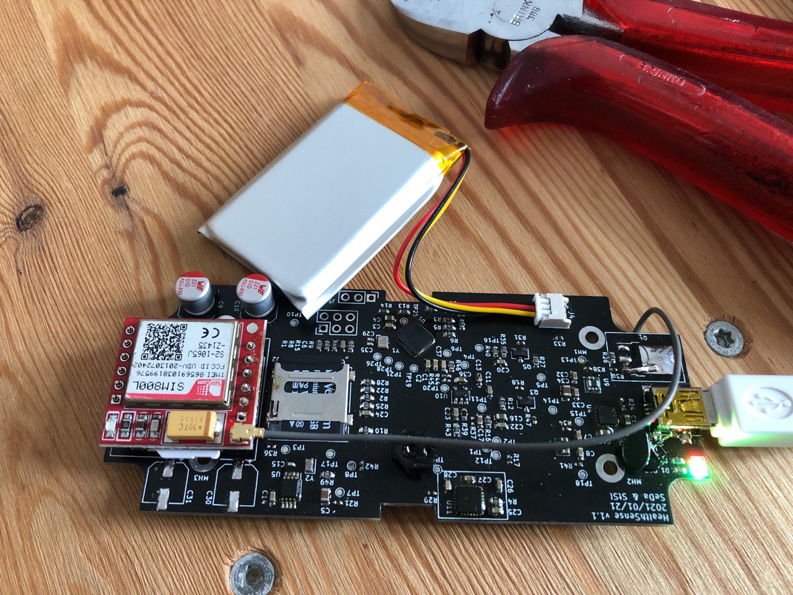
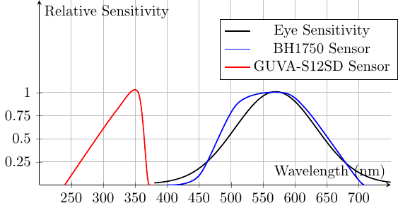

# Health Sense

Health Sense is a repository that houses the design files for a portable sensor module specifically designed to measure the light intensity in the spectrum of the human eye. This module is primarily developed for research purposes to accurately quantify the light exposure experienced by the human eye.

## Table of Contents
- [Introduction](#introduction)
- [Features](#features)
- [Revisions](#Revisions)
- [Sensors Used](#sensors-used)
- [Getting Started](#getting-started)
- [Usage](#usage)
- [Contributing](#contributing)
- [License](#license)

## Introduction

The human eye is highly sensitive to light, and prolonged exposure to certain intensities and spectrums can have various effects on our overall health and well-being. The Health Sense project aims to provide researchers with a reliable and portable tool for measuring light exposure and analyzing its impact on human subjects.

This repository contains the design files and relevant documentation for the Health Sense sensor module. By using this module, researchers can gather accurate data on light exposure, which can be further utilized for scientific studies, understanding circadian rhythms, evaluating the effects of light on sleep patterns, and other related research areas.

## Features

- **Portable Design**: The Health Sense sensor module is designed to be compact and portable, allowing researchers to easily carry and use it in different environments.
- **Light Intensity Measurement**: The module accurately measures the light intensity in the spectrum of the human eye, providing valuable data for research purposes.
- **Customizable Spectral Range**: Researchers can adjust the spectral range of measurement based on their specific requirements, enabling flexibility in studying different light sources.
- **Data Logging**: The module is equipped with data logging capabilities, allowing researchers to record and analyze light exposure data over extended periods of time.
- **User-Friendly Interface**: The sensor module includes a user-friendly interface, making it easy to operate and configure the device for different research settings.

## Revisions
### Prototyping
Breadboard setup created to verify the correct functionallity of all included sensors.

### Revision 1.0
Two prototypes are manufactured and assembled by hand as a final POC. The uC is loaded with the arduino-bootloader.

### Revision 1.1
Five prototypes are manufactured ans assembled. Enclosure holes are milled with CNC.

### Known Issues
* Enable transistor for SIM800L not working
* SIM800L as solder-on pcb not optimal. 2/5 modules hat to be replaced.
* Charging current of 100mA could be increased
* Temperature Sensor of lipo not connected to charger IC

## Sensors Used

The Health Sense sensor module incorporates the following sensors:

- Ambient Light Sensor (BH1750): Measures light intensity in the visible spectrum.
- UV-B Sensor (GUVA-S12SD): Measures light intensity in the ultraviolet spectrum.
- Gyroscope Sensor (MPU-6050): Detects and measures orientation and rotation.
- RTC Clock (PCF8563TS): Provides accurate timekeeping functionality for scheduling and data timestamping.
- UMTS Module (SIM800L): Enables communication and data transmission via UMTS cellular network.

The integration of these sensors allows for comprehensive data collection and analysis related to light exposure in the context of research.

## Getting Started

To get started with the Health Sense sensor module, follow the steps below:

1. **Hardware Requirements**: Ensure you have the necessary components to assemble the sensor module. Refer to the [BOM](docs/BillOfMaterials_v1.1.csv) and [Schematic](HealthSenseSchematic_v1.1.pdf) for detailed information.

2. **Software Setup**: Install the Arduino IDE, the firmware hexfile can be generated using the arduino ide, choose the Nano Board. Flash the firmware via ISP connector J1.

3. **Calibration**: Before using the sensor module, it is important to calibrate it for accurate light intensity measurements.

4. **Usage**: Once the sensor module is assembled, calibrated, and ready, you can start using it to measure light exposure in your research. See the [Usage](#usage) section for more details.

## Usage

To utilize the Health Sense sensor module for measuring light exposure, follow these steps:

1. Connect the sensor module to a power source and ensure it is properly configured.

2. Position the module in the desired location to measure the light exposure of the human eye.

3. Initiate the measurement process by using the provided software interface or API. The module will start recording light intensity data in the specified spectral range.

4. Allow the module to collect data for the desired duration. The logged data can be stored internally or transmitted to an external device for analysis.

5. Analyze the collected data using appropriate data analysis tools to draw insights and conclusions regarding light exposure in your research.

Refer to the [User Guide](docs/user_guide.md) for detailed instructions on using the Health Sense sensor module effectively.

## Contributing

We welcome contributions from the community to enhance the Health Sense project. If you would like to contribute, please follow the guidelines outlined in the [Contributing](CONTRIBUTING.md) document.

## License

The Health Sense project is licensed under the [MIT License](LICENSE). 

## Contact

For any inquiries or feedback regarding the Health Sense project, please contact our team. We appreciate your interest and support!
